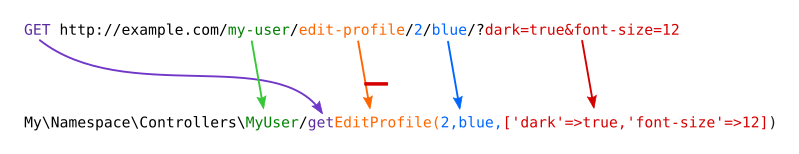

# Peasy Router
Peasy Router is an **easy peasy** and opinionated router for PHP.
It is meant to be used with small projects that need a very basic
ruting functionality. Nothing complicated.

## Installation

### Using composer

```shell
composer require artkoder/peasy-router
```

## Configure your .htaccess file

Add the following code to your `.htaccess` inside a public folder
at the same level as your `index.php`. 

```
<IfModule mod_rewrite.c>
    # Redirect Trailing Slashes If Not A Folder...
    RewriteCond %{REQUEST_FILENAME} !-d
    RewriteCond %{REQUEST_URI} (.+)/$
    RewriteRule ^ %1 [L,R=301]

    # Send Requests To Front Controller...
    RewriteCond %{REQUEST_FILENAME} !-d
    RewriteCond %{REQUEST_FILENAME} !-f
    RewriteRule ^ index.php [L]
</IfModule>

```

## Setting `index.php`

```php
// public/index.php
require_once __DIR__ . '/../vendor/autoload.php';

use ArtKoder\Peasy\Http\Router;

// You need to pass the namespace of your controllers
$router = new Router('My\\Namespace\\Controllers\\');

$router->handleRequest();
```

## Routing with Peasy Router

Peasey router maps the URL to a specific class and method,
normally inside a `Controllers` folder.



From the example above, we can grab all the information we need to build a controller to handle the request:

```
# Class name: My\Namespace\Controllers\MyUser
# Function name: getEditProfile
# Function arguments: ['2', 'blue']
# Query parameters: ['dark'=>'true', 'font-size'=>'12']
```

Consider the following GET request:

GET https://domain.com/controller-class/function-to-use/arg1/arg2/arg3?param1=value1&param2=value2
 

The router will call the following method:

```php
My\Namespace\Controllers\ControllerClass::getFunctionToUse('arg1', 'arg2', 'arg3',['param1'=>'value1', 'param2'=>'value2']);
```

* The first part of the URL is the name of the controller in `PascalCase`. In the example, `controller-class` 
  becomes `ControllerClass`. 
* The name of the function is composed of the http method (GET or POST) followed by the
  second part of the url in `camelCase`. In the example above, the method `GET` and the function `function-to-use` 
  becomes `getFunctionToUse()`.
* If no controller is specified, then the `Home` controller will be used by default.
* If no method is specified, then the `getIndex()` method will be used by default.
* From the third part of the URL on, each part corresponds to one argument that is passed to the function.
* The last argument passed to the function contains the URL query parameters as an associative array.

Some examples:

| Method | URL                                | Maps to                           | Comment                  |
| ------ | ---------------------------------- | --------------------------------- | ------------------------ |
| GET    | http://localhost/                  | `Home::getIndex()`                | Show home page           |
| GET    | http://localhost/contacts/         | `Contacts::getIndex()`            | Show list of contacts    |
| GET    | http://localhost/contacts/show/1   | `Contacts::getShow(1)`            | Show contact with id 1   |
| POST   | http://localhost/contacts/delete/1 | `Contacts::postDelete(1)`         | Delete contact with id 1 |
| GET    | http://localhost/contacts/new/     | `Contacts::getNew()`              | Show new contact form    |
| POST   | http://localhost/contacts/new/     | `Contacts::postNew($queryParams)` | Create new contact       |

## Controllers

Controllers are responsible for handling the request. They are called by the [Router](#routing).

You need to create Controllers to handle the requests. Here are the steps to create a controller:
- Decide where your controllers will live and take note of the namespace. E.g. `src\Controllers`.
- When you instantiate the router, you will specify the namespace where all your controllers will live.
- Create a php file with the name of the controller. 
- Add the namespace that you chose to use for the controllers.
- Define the function that will handle the request, it needs to be `static`. The function contains the code that will
  render the page.

Here is an example:

We want to display a list of contacts when we visit the page http://localhost:8000/contacts.
Since we are going to use the browser to visit this page, this is going to be a `GET` request.

First, in `index.php`, we instantiate the router and specify the namespace.
```php
require_once __DIR__ . '/../vendor/autoload.php';

use ArtKoder\Peasy\Http\Router;

$router = new Router('My\\Namespace\\Controllers\\');

$router->handleRequest();

```

We need to create a controllers class:

```php
// File: src/Controllers/Contacts.php

namespace My\Namespace\Controllers;

class Contacts
{
    public static function getIndex()
    {
        echo "Displaying a list of contacts...";
    }
}
```

We want to be able to display the details of a single contact, for example by visiting the following URL:
http://localhost:8000/contacts/show/5.

Let's add another function to the `Contacts` class.

```php
// File: app/Controllers/Contacts.php

namespace My\Namespace\Controllers;

class Contacts
{
    public static function getIndex()
    {
        echo "Displaying a list of contacts...";
    }

    public static function getShow($contactId) 
    {
        echo "Showing details for contact with id $contactId";
    }
}
```

What if we want to modify the details of a specific contact? We need to show a form to let the user input the
new contact information. The URL may be http://localhost:8000/contacts/edit/5

```php
// File: src/Controllers/Contacts.php

namespace My\Namespace\Controllers;

class Contacts
{
    public static function getIndex()
    {
        echo "Displaying a list of contacts...";
    }

    public static function getShow($contactId) 
    {
        echo "Showing details for contact with id $contactId";
    }

    public static function getEdit($contactId)
    {
        echo "Showing a form to edit contact with id $contactId";
    }
}
```

When the user submits the form, it will send a `POST` request to the following URL:
http://localhost:8000/contacts/edit/5. Notice that we can use the same URL
because this is a `post` request, therefore, the function that handles the request
will be different.

```php
// File: src/Controllers/Contacts.php

namespace My\Namespace\Controllers;

class Contacts
{
    public static function getIndex()
    {
        echo "Displaying a list of contacts...";
    }

    public static function getShow($contactId) 
    {
        echo "Showing details for contact with id $contactId";
    }

    public static function getEdit($contactId)
    {
        echo "Showing a form to edit contact with id $contactId";
    }

    public static function postEdit($contactId, $queryParameters)
    {
        echo "Saving information contact with id $contactId";
    }
}
```


